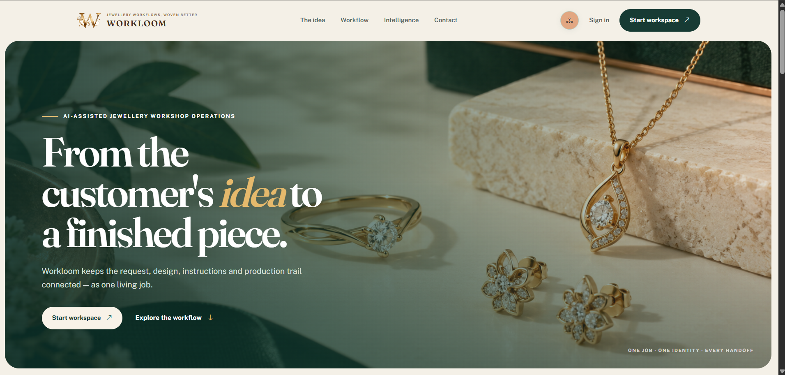
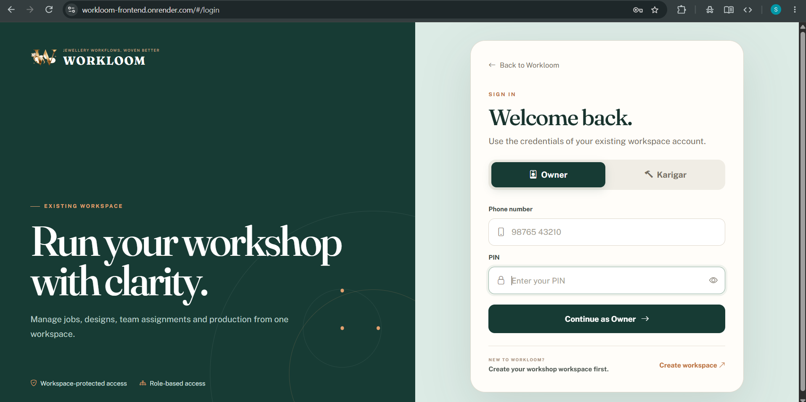
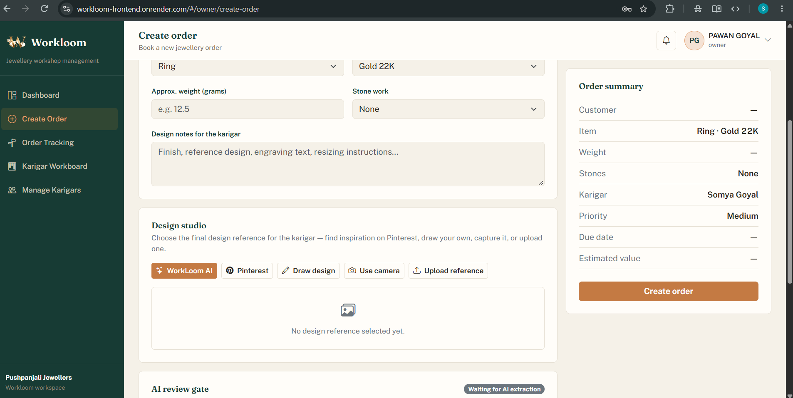
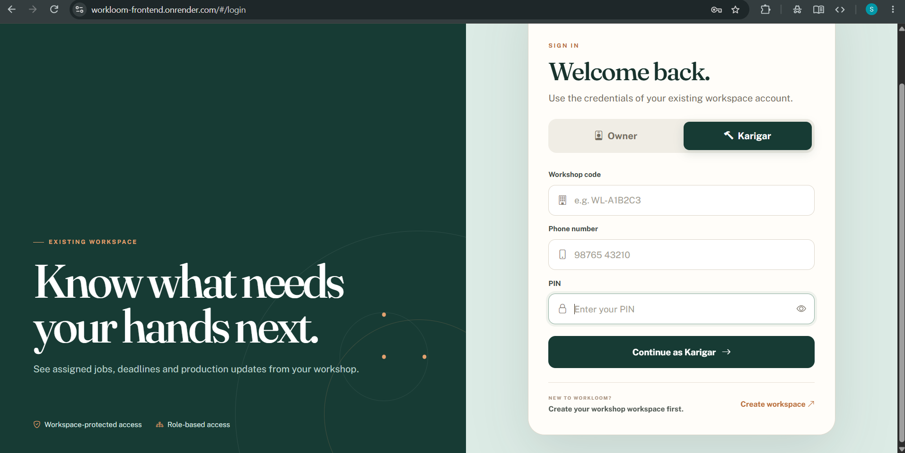
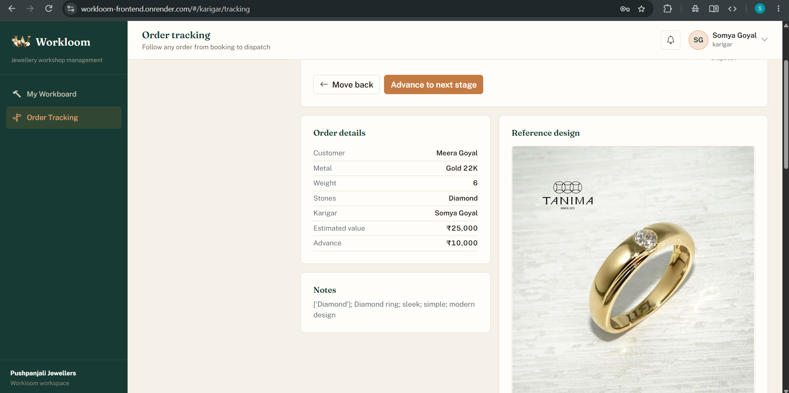

# WorkLoom

  
  
  
  
  
  
  

### AI-Assisted Jewellery Workshop Operations

**From the customer's idea to a finished piece.**

Connect jewellery orders, karigar assignments, production tracking,
design references and workshop operations in one unified workflow.

## 💡 What is WorkLoom?

**WorkLoom** is an AI-assisted jewellery workshop system built to connect
order workflows, karigar coordination, production tracking and jewellery
design intelligence in one place.

It helps workshop users manage an order from design intake and assignment
through production stages, while AI-assisted voice input and semantic design
retrieval provide faster access to operational and design information.

## ✨ Key Features

- **AI Design Retrieval** — Find relevant jewellery design references using CLIP-based embeddings and FAISS similarity search.
- **Voice-Assisted Input** — Convert voice-based workshop input into structured information.
- **Structured Order Workflow** — Organize jewellery orders across defined production stages.
- **Karigar-Specific Workspaces** — Provide assigned work and relevant order visibility to workshop members.
- **Centralized Design References** — Maintain a searchable library of jewellery design references.
- **Workshop Insights** — Track operational activity through notifications and analytics.

## 🖼️ Screenshots

### Landing Page
## 🖼️ Screenshots

### Landing Page

  

<strong>View More Screenshots</strong>

### Owner Login

  

### Workshop Dashboard

  

### Create Order

  

### Karigar Login

  

### Karigar Workboard

  

### Order Tracking

  

## 🏗️ Architecture Overview

<pre>
                           WORKLOOM
                              │
                    Workshop User / Input
                              │
          ┌───────────────────┼───────────────────┐
          ▼                   ▼                   ▼
   Order Management    Workshop Management    AI Services
   (Orders, Stages,    (Karigar, Customers,   (Voice AI,
    Tracking)           Issues, Team)          Design Retrieval)
          │                   │              ┌─────┴─────┐
          │                   │              ▼           ▼
          │                   │       CLIP ViT-B/32      ONNX Runtime
          │                   │            └──────┬────────┘
          │                   │                   ▼
          │                   │                 FAISS
          │                   │              └─────┬─────┘
          │                   │                    ▼
          │                   │              Similar Designs
          └───────────────────┼───────────────────┘
                              ▼
                       Application Results
                              │
                    ┌─────────┴─────────┐
                    ▼                   ▼
                MongoDB          Reference Library
               (App Data)       (Images + Embeddings)
</pre>

## 📁 Directory Layout

<pre>
WorkLoom/
│
├── backend/                         # FastAPI backend
│   ├── app/
│   │   ├── main.py                  # FastAPI application entry point
│   │   ├── config.py                # Environment configuration
│   │   ├── database.py              # MongoDB connection & indexes
│   │   ├── auth.py                  # Authentication & authorization
│   │   ├── design_retrieval.py      # CLIP + ONNX + FAISS retrieval
│   │   ├── models/
│   │   │   └── order.py             # Order schemas & validation
│   │   └── routes/
│   │       ├── orders.py            # Order management
│   │       ├── team.py              # Karigar/team management
│   │       ├── customer.py          # Customer operations
│   │       ├── analytics.py         # Workshop analytics
│   │       ├── reference_images.py  # Reference image endpoints
│   │       └── ...                  # Other API routes
│   │
│   ├── setup_reference_library.py   # Builds AI reference library
│   ├── reset_workloom_data.py       # Resets application data
│   ├── requirements.txt             # Backend dependencies
│   └── .env.example                 # Environment template
│
└── frontend/                        # React frontend
    ├── src/
    │   ├── components/              # Reusable UI components
    │   ├── pages/                   # Application screens
    │   ├── services/                # API service modules
    │   ├── assets/                  # Application assets
    │   ├── styles/                  # Application styles
    │   ├── constants.js             # Shared application constants
    │   ├── App.jsx                  # Root React component
    │   ├── index.css                # Global styles
    │   └── main.jsx                 # Frontend entry point
    │
    └── public/                      # Public assets & project logo
</pre>

## ⚙️ Setup & Installation

### 🔧 Configure the Environment

Clone the repository:

    git clone https://github.com/somyagoyal09/WorkLoom.git
    cd WorkLoom

Create and activate a Python virtual environment:

    cd backend
    python -m venv .venv

On Windows:

    .venv\Scripts\activate

Install backend dependencies:

    pip install -r requirements.txt

Create the local environment file:

    copy .env.example .env

Add the required local configuration and API credentials to `.env`.

> **Note:** `.env` contains private credentials and should never be committed to GitHub.

Install frontend dependencies:

    cd ../frontend
    npm install

Prepare the AI reference library:

    cd ../backend
    python setup_reference_library.py

 This prepares the jewellery reference images, generates CLIP-based image
embeddings and builds the FAISS index required for design retrieval.

> **AI Reference Library:** The prepared reference library is maintained
> separately from user uploads and contains the images and embeddings used
> for semantic design retrieval.

## ▶️ Running the Application

### 🚀 Start the FastAPI Backend

From the `backend` directory:

    uvicorn app.main:app --reload

Backend:

    http://127.0.0.1:8000

### 🌐 Start the Frontend

From the `frontend` directory:

    npm run dev

Frontend:

    http://localhost:5173

### 📖 API Documentation

FastAPI provides interactive API documentation at:

    http://127.0.0.1:8000/docs

## 🔗 Project Links

🌐 **Live Application:** https://workloom-frontend.onrender.com/

⚙️ **Backend API:** https://workloom-fb22.onrender.com/

📖 **API Documentation:** https://workloom-fb22.onrender.com/docs

💻 **GitHub Repository:** https://github.com/somyagoyal09/WorkLoom

## 📜 License

This project is licensed under the **MIT License**.

You are free to use, copy, modify, merge, publish, distribute, sublicense,
and sell copies of the software, subject to the conditions of the MIT License.

The copyright notice and license notice must be included in all copies or
substantial portions of the software.

For complete terms and conditions, please refer to the
[LICENSE](LICENSE) file.

## 📬 Get in Touch

Got questions, suggestions, or just want to get in touch?

📧 **somyagoyal113@gmail.com**

**WorkLoom — From the customer's idea to a finished piece.**

